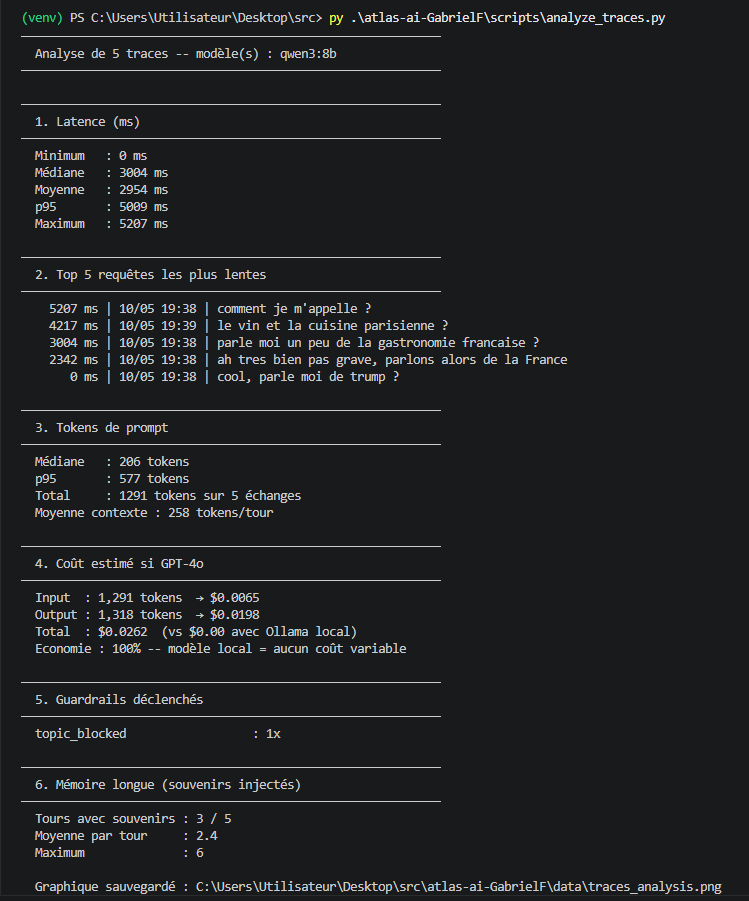
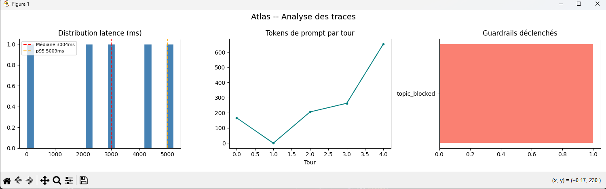

# Monitoring — Atlas

Chaque interaction avec Atlas génère automatiquement une trace structurée. Ces traces permettent d'analyser les performances, les coûts et le comportement des guardrails sur la durée.

---

## Comment ça fonctionne

À chaque échange, Atlas écrit une ligne JSON dans `data/traces.jsonl` :

```json
{
  "timestamp": "2025-05-10T19:38:00.000Z",
  "session_id": "a3f9c1b2",
  "model": "qwen3:8b",
  "prompt_tokens": 206,
  "completion_tokens": 87,
  "latency_ms": 3004,
  "user_message": "comment je m'appelle ?",
  "assistant_message": "Vous vous appelez David...",
  "memory_hits": 2,
  "guardrails_triggered": []
}
```

| Champ | Description |
|---|---|
| `prompt_tokens` | Tokens envoyés au modèle (contexte complet) |
| `completion_tokens` | Tokens générés par le modèle |
| `latency_ms` | Temps de réponse en millisecondes |
| `memory_hits` | Nombre de souvenirs injectés depuis la mémoire longue |
| `guardrails_triggered` | Règles déclenchées (PII, topic_blocked, injection...) |

> **Politique RGPD** : `user_message` et `assistant_message` sont tronqués à 200 / 500 caractères. Aucune donnée n'est envoyée à l'extérieur — tout reste dans `data/` en local.

---

## Lancer l'analyse

```bash
python scripts/analyze_traces.py

# Spécifier un fichier de traces
python scripts/analyze_traces.py --file data/traces.jsonl

# Sans graphiques matplotlib
python scripts/analyze_traces.py --no-plot
```

---

## Résultats — Session de test (5 échanges, modèle qwen3:8b)

### Rapport terminal



Le rapport couvre 6 sections :

**1. Latence (ms)**
La médiane se situe à ~3 secondes, le p95 à ~5 secondes. Le 0 ms correspond à un échange bloqué par un guardrail avant même d'atteindre le modèle.

**2. Top 5 requêtes les plus lentes**
Les requêtes les plus longues sont celles avec le plus de contexte injecté (souvenirs + historique). On voit que "comment je m'appelle ?" a été la plus lente : la mémoire longue a injecté 6 souvenirs dans le prompt ce tour-là.

**3. Tokens de prompt**
- Médiane : 206 tokens
- p95 : 577 tokens
- Total session : 1 291 tokens sur 5 échanges

La croissance est visible sur le graphique — le contexte s'accumule à chaque tour.

**4. Coût estimé si GPT-4o**
| | Tokens | Coût |
|---|---|---|
| Input | 1 291 | $0.0065 |
| Output | 1 318 | $0.0198 |
| **Total** | | **$0.0262** |

Avec Ollama local : **$0.00**. Économie : 100%.

**5. Guardrails déclenchés**
`topic_blocked` : 1 déclenchement — la requête *"cool, parle moi de trump ?"* a été bloquée et a reçu un refus poli sans appel au modèle (d'où la latence 0 ms).

**6. Mémoire longue**
3 tours sur 5 ont bénéficié de souvenirs injectés, avec une moyenne de 2.4 souvenirs par tour et un pic à 6.

---

### Graphiques



Les trois graphiques confirment les chiffres du rapport :

- **Distribution latence** — les barres se concentrent entre 2 000 et 5 000 ms, avec la médiane (rouge) et le p95 (orange) bien visibles.
- **Tokens de prompt par tour** — la courbe monte de façon quasi-linéaire : chaque tour accumule le contexte des précédents + les souvenirs injectés.
- **Guardrails déclenchés** — une seule règle active sur cette session : `topic_blocked`.

---

## Interprétations

**Pourquoi les tokens augmentent à chaque tour ?**
Deux raisons cumulées : l'historique de session (`max_turns = 20`) et les souvenirs injectés depuis ChromaDB. Plus la session avance, plus le prompt grossit.

**Pourquoi une latence à 0 ms ?**
Les messages bloqués par un guardrail n'atteignent jamais Ollama. La trace est quand même écrite pour garder une visibilité complète.

**Comment réduire la latence ?**
- Diminuer `memory.top_k` dans `config/atlas.yml` pour injecter moins de souvenirs
- Diminuer `memory.max_turns` pour réduire l'historique envoyé
- Utiliser un modèle plus léger (`qwen3:4b`) si la qualité le permet